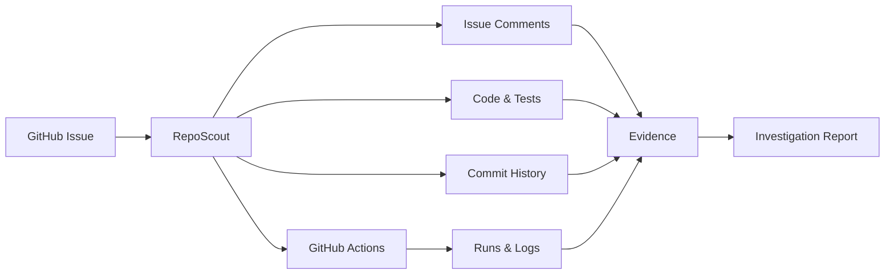

### RepoScout Testing

A small controlled repository created to test and validate [RepoScout](https://github.com/neelkumar01/repoScout)

This repository contains intentionally simple bugs and GitHub issues designed to test different parts of RepoScout's investigation workflow

> [!IMPORTANT]
> Since the expected cause of each issue is known beforehand it makes it easier to check whether RepoScout finds the right evidence, chooses useful tools, and handles uncertainty properly

### Why This Repository?

Testing an issue investigation agent only on real world repositories can be difficult because the actual root cause is not always known. This repository provides a small and predictable environment where different investigation scenarios can be tested independently

The goal is not to build a complex application here but the goal is to test how RepoScout investigates different kinds of GitHub issues

### Test Scenarios

Each issue was created to test a different aspect of the investigation workflow

| Issue | What it tests | RepoScout agent investigation | Result | Report |
|---|---|---|---|---|
| [#1](https://github.com/neelkumar01/repoScout-testing/issues/1) | Finding a simple bug by reading the issue, code, and tests | Found the parse_timeout() bug and correctly explained why an empty value crashes | ✅ Correct root cause with high confidence | [View report](https://github.com/neelkumar01/repoScout/blob/main/reports/repoScout-testing-issue-1-2026-08-15_17-13-01.md) |
| [#2](https://github.com/neelkumar01/repoScout-testing/issues/2) | Connecting a reported bug with the exact faulty code and failing test | Found the tags[:-1] bug that was removing the last tag | ✅ Correct source level diagnosis | [View report](https://github.com/neelkumar01/repoScout/blob/main/reports/repoScout-testing-issue-2-2026-08-15_17-34-22.md) |
| [#3](https://github.com/neelkumar01/repoScout-testing/issues/3) | Investigating a CI only failure using code, workflow config, environment settings and CI runs | Connected the CI failure to the APP_MODE difference between the test and workflow | ✅ Strong multi source CI diagnosis | [View report](https://github.com/neelkumar01/repoScout/blob/main/reports/repoScout-testing-issue-3-2026-08-15_17-20-38.md) |
| [#4](https://github.com/neelkumar01/repoScout-testing/issues/4) | Following application state and related functions to find a cache bug | Found that delete_user() was not actually removing users from the cache | ✅ Correct state/cache diagnosis | [View report](https://github.com/neelkumar01/repoScout/blob/main/reports/repoScout-testing-issue-4-2026-08-15_17-24-48.md) |
| [#5](https://github.com/neelkumar01/repoScout-testing/issues/5) | Handling a vague issue without being too confident when evidence is limited | Found a possible cache related cause while clearly noting that there was not enough evidence to prove it | ✅ Useful hypothesis with uncertainty clearly reported | [View report](https://github.com/neelkumar01/repoScout/blob/main/reports/repoScout-testing-issue-5-2026-08-15_17-52-37.md) |
| [#6](https://github.com/neelkumar01/repoScout-testing/issues/6) | Reading issue comments to find missing context and using it to investigate the code | Used details from an issue comment to find and explain the CSV parsing bug | ✅ Comment driven investigation worked as intended | [View report](https://github.com/neelkumar01/repoScout/blob/main/reports/repoScout-testing-issue-6-2026-08-16_05-23-28.md) |
| [#7](https://github.com/neelkumar01/repoScout-testing/issues/7) | Using commit history to understand a regression and find what changed | Compared current and older code through commit history and identified the .lower() → .upper() regression | ✅ Commit history investigation worked as intended | [View report](https://github.com/neelkumar01/repoScout/blob/main/reports/repoScout-testing-issue-7-2026-08-16_05-43-37.md) |

### Investigation Coverage

Different issues require different investigation paths

